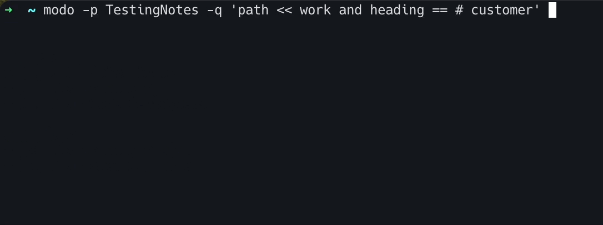

# modo
markdown todo cli interface is a small application to query markdown todos with a SQL-like syntax.
This is my first project in rust and will be improved over time. Some parts may be implemented not ideal.

## Usage
call modo with a path to a folder with markdown files (--path or -p) and the query (--query or -q).
Eg: `modo -p /User/phil/Notes -q 'done == false'`. Empty path will use `.`. 

### Keybindings
- `j/k` and `arrow up/down` for navigation in the todo list.
- `x` toggles a todo done/open.
- `d` shows todo details.
  - `x` toggle todo and returns to list.
  - `any other key` returns to list.
- `r` reloads.
- `q` quits.

## Filter Queries
An empty query will return all todos. All filters are case insentivite.
Multiple filters can be used with "and" between them.

Syntax has to be: \<todo-property\> \<operator\> \<value\>

### Properties
Filters always bear upon a single todo.
- `name` (entire line of the todo)
- `filename` (file where the todo is located)
- `path` (full path, including filename)
- `heading` (first heading (line that starts with #) that is found above the todo)
- `done` (if todo is marked as done)

### Operators
- `==` equals
- `!=` does not equal
- `<<` contains 
- `!<` does not contain

### Examples
- `done == false`
- `path << customername and done == false`
- `done == true and path !< "Arbeit"`
- `done == false and heading == "Daily"`
- `heading == "Daily"`
- `path << "Work" and path !< "customer"`

## Feature ideas
- Ordering todos via query 
- Grouping and OR support for filters
- Give feedback about query parts that are wrong
- Shortcut to open the .md file a todo is in the systems set .md editor
- Display options, specify what properties of the todo should be displayed
- Option to edit the query in the app
